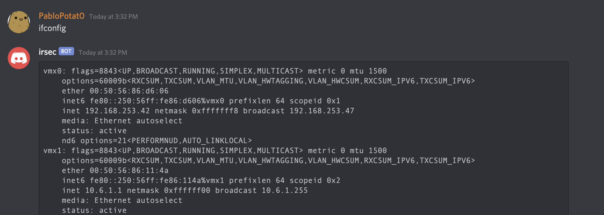
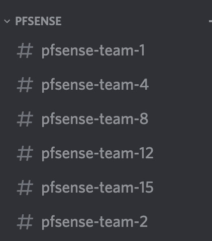

# DiscordGo
Discord C2 for Redteam....Need a better name.
If you can think of one, please tell me. :)


# Why I made this

During Blue-Red Team competition, I needed an easy and fast way to keep connected.
Since Discord is getting popular, why not use the platorm as a c2.
That's what this project is about.

# How to use

* Compile the binary
* Run in on your target
* Now wait, and you should get a notification about a new channel being created

* Video coming soon





# Build

`go build main.go`

# TODO

- [ ] Statically comile the config file
- [ ] Cross-platorm
- [ ] File upload and download

# Config file

This is example config. Replace the bot_token and server_id with yours and you should be good to go

```
# Discord configurations
discord:
  bot_token: "NzAyODc0Mzc5ODI2MjMzNDY0.XqJdpw.0kDsBSL0GmrX4PL6cJgXHltwTEc"
  server_id: 9999

# Channel configurations
channel:
  category_name: "bsd"
  channel_name: "bsd-team"

```

# Disclamers
The author is in no way responsible for any illegal use of this software. It is provided purely as an educational proof of concept. We are also not responsible for any damages or mishaps that may happen in the course of using this software. Use at your own risk.

# Used Libraries
* [disgord](https://github.com/andersfylling/disgord)


Inspired by [SierrOne](https://github.com/berkgoksel/SierraOne)