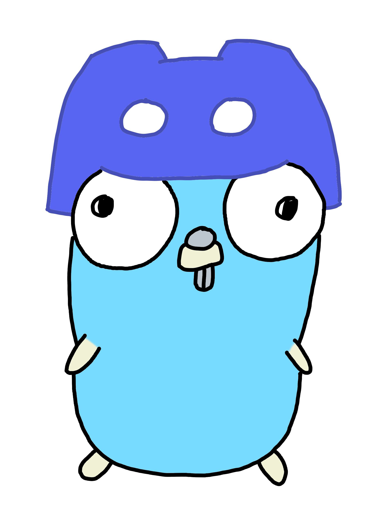
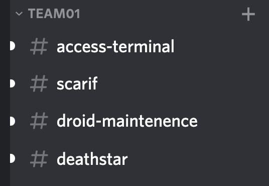

<h1 align="center"> DiscordGo </h1> 
<p align="center">
  <a>
    
  </a>
</p>


[](https://goreportcard.com/report/github.com/emmaunel/DiscordGo)


Discord C2 for Redteam engagement....Need a better name.
If you can think of one, please tell me. :)

Not to be confused with DiscordGo library which I use for the backend.

# Why I made this

During Blue-Red Team competition, I needed an easy and fast way to keep connected and a way for mutiple redteamer to run commands, hence DiscordGo.
Since Discord is getting popular, why not use the platorm as a c2.
That's what this project is about.

# Installation

To use DiscordGo, you need to create a Discord bot and a Discord server. After that, invite the bot to your server.

Click [here](https://support.discord.com/hc/en-us/articles/204849977-How-do-I-create-a-server-) to learn how to create a server and [here](https://discordjs.guide/preparations/setting-up-a-bot-application.html#creating-your-bot) to create a bot. And finally, learn to invite the bot to your server with [this.](https://discordjs.guide/preparations/adding-your-bot-to-servers.html#bot-invite-links)

When creating the bot, you need it give it some permission. For testing, I gave the bot full `administrative` permission. But the required permission are as follow:

* Send Messages
* Read Messages
* Attach Files
* Manage Server

# Usage

Edit this file `pkg/util/variables.go` with your `BotToken` and `ServerID`. Or create the file if not there

The bot token can be found on discord developer dashboard where you created the bot. To get your server ID, go to your server setting and click on `widget`. On the right pane, you see the your ID.

An example configuration file looks like this:
```
var ServerID = "XXXXXXXXXXX"
var BotToken = "XXXXXXXXXXX"
```

After that is done, all you have to do is run `make`. That will create 3 binaries.

```
- linux-agent
- windows-agent.exe
- macos-agent
```

## Organizer Bot

When you have target connecting back to your discord server, channels are created by their ip addresses. This can quickly get hard to manage. Solution: Another bot to organize the targets channels.

To use the organizer bot, run the csv generator script in the scripts folder:
```
$ pip3 install -r requirements.txt
$ python3 csv_generator.py
```

This will create a csv like this:

```
192168185200,team01,hostname1,windows
192168185201,team02,hostname2,linux
```

To start the organizer bot: `go run cmd/organizer/main.go -f <csv_filename>.csv`

Run `clean` in any channel to organize bots into their respective categories.

# Feature

* Cross-platform
* Organozer(talk about and intergration to pwnboard)


# WIP (Work in Progress)

- [x] Cross-platform
- [x] File upload
- [x] File download
- [x] Agent grouping(by hostname like web hosts and so on, slash command)
- [x] Group commands
- [X] Add logging to organizer
- [X] Comp CSV Generation file
- [ ] Integrate with pwndrop


# Screenshots
<p align="center">
  <a>
    
  </a>
</p>
<p align="center">
  <a>
    
  </a>
</p>

# Co-Authors

* @Fred(https://github.com/frybin)
Thanks for late night fixes during deploy

# Disclamers
The author is in no way responsible for any illegal use of this software. It is provided purely as an educational proof of concept. I am also not responsible for any damages or mishaps that may happen in the course of using this software. Use at your own risk.

Every message on discord are saved on Discord's server, so be careful and not upload any sensitive or confidential documents.

# Used Libraries
* [discordgo](https://github.com/bwmarrin/discordgo)


Inspired by [SierrOne](https://github.com/berkgoksel/SierraOne)

Logo by @BradHacker(https://github.com/BradHacker)